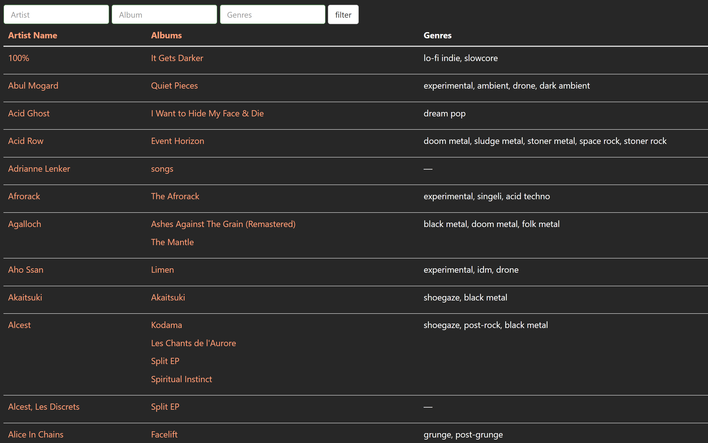
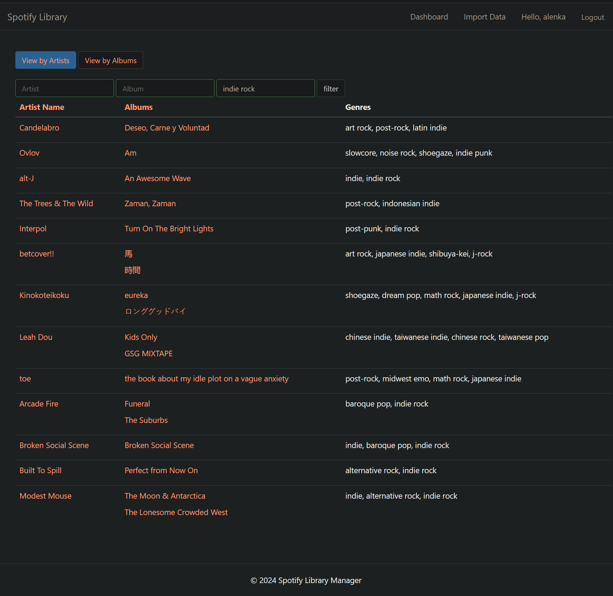
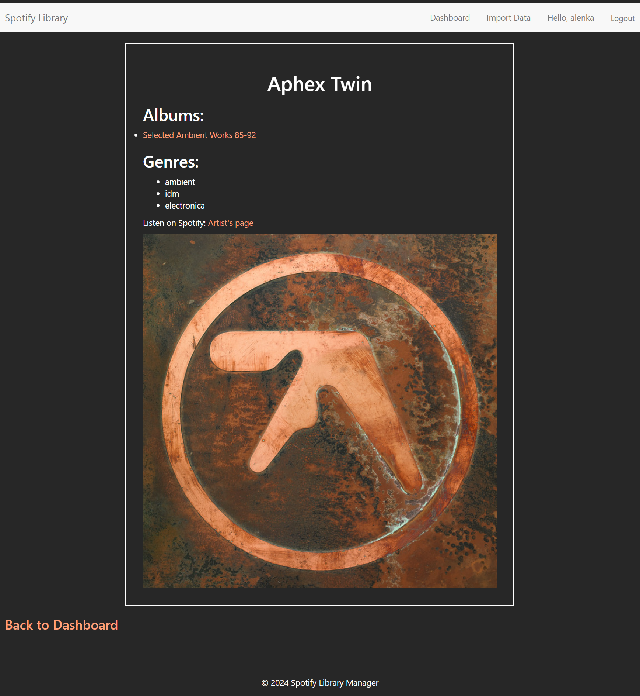
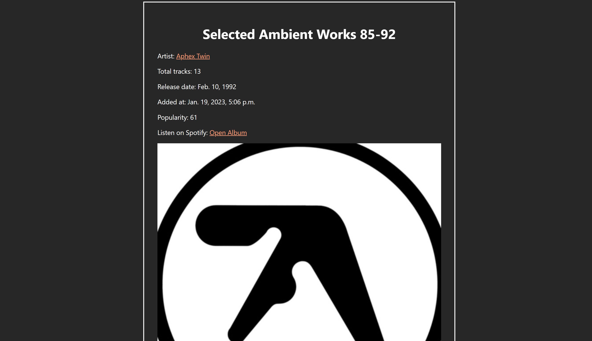

[](https://github.com/AlenkaJ/SpotifyDjangoApp/actions/workflows/tests.yml)
[](https://github.com/AlenkaJ/SpotifyDjangoApp/actions/workflows/code_quality.yml)
[](https://github.com/pylint-dev/pylint)

# Spotify Music Library Manager

This web app loads the saved albums from your Spotify library and allows you to browse or filter the albums at your leisure.

## Features

- 🔐 User authentication via Spotify OAuth
- 🎵 Explore all your saved albums and artists
- ⚡ See which genres Spotify assigns them
- 📊 Filter by artist name, album name, and/or genres

## Tech Stack

- **Backend:** Django, Celery, Redis, PostgreSQL
- **APIs:** Spotify Web API (via Spotipy)
- **Frontend:** Django templates, django-tables2, django-filter
- **Dev Tools:** GitHub Actions (CI/CD), black, isort, flake8, pylint

## Screenshots

### Dashboard



### Artist Detail


### Album Detail


## Setup

### Prerequisites
- Python 3.x
- PostgreSQL
- Redis
- Spotify Developer Account

### Installation

1. Clone the repository:
```bash
git clone https://github.com/AlenkaJ/SpotifyDjangoApp.git
cd SpotifyDjangoApp
```

2. Build and run the Docker containers (make sure Docker and Docker Compose are installed and running): 
```bash
docker-compose up
```

3. Visit `http://127.0.0.1:8000/spotify_filter/` and start importing your Spotify data!

## Usage

Log in or create an account to be able to connect your Spotify data safely. Then, click "Connect Spotify & Import Data" button to get fresh data from your Spotify library. If you already did this before and you are happy with the current state of the database contents, you can click "Go to an existing dashboard".
When looking at the dashboard, you can use the bars at the top to filter the artists, albums, and genres by name. You can filter for multiple genres at the same time - just divide them by "," or " ".
You can also look at the details of each artist and album using their link.

## Development

### Running Tests
```bash
docker-compose run web python manage.py test
```

### Code Quality
The project uses GitHub Actions for automated testing and code quality checks (black, isort, flake8, pylint).

## Future Improvements

- [ ] Provide more insights about the Spotify library (statistics, graphs)
- [ ] Include data from more sources, starting with LastFM tags
- [ ] Create a similarity metric between the artists for search and visualization purposes

## Related Projects

This project evolved from an earlier data analysis exploration: [SpotifyShenanigans](https://github.com/AlenkaJ/SpotifyShenanigans)
