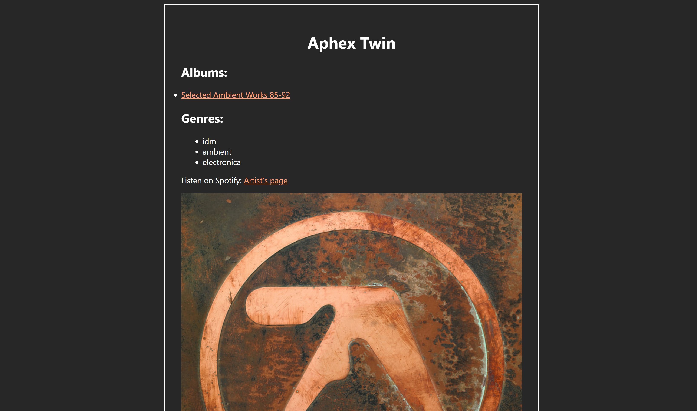

[](https://github.com/AlenkaJ/SpotifyDjangoApp/actions/workflows/tests.yml)
[](https://github.com/AlenkaJ/SpotifyDjangoApp/actions/workflows/code_quality.yml)
[](https://github.com/pylint-dev/pylint)

# Spotify Music Library Manager

This web app loads the saved albums from your Spotify library and allows you to browse or filter the albums at your leisure.

## Features

- 🎵 Explore all your saved albums and artists
- ⚡ See which genres Spotify assigns them
- 📊 Filter by artist name, album name, and/or genres

## Tech Stack

- **Backend:** Django, Celery, Redis, PostgreSQL
- **APIs:** Spotify Web API (via Spotipy)
- **Frontend:** Django templates, django-tables2, django-filter
- **Dev Tools:** GitHub Actions (CI/CD), black, isort, flake8, pylint

## Screenshots

### Dashboard


### Artist Detail


### Album Detail


## Setup

### Prerequisites
- Python 3.x
- PostgreSQL
- Redis
- Spotify Developer Account

### Installation

1. Clone the repository:
```bash
git clone https://github.com/AlenkaJ/SpotifyDjangoApp.git
cd SpotifyDjangoApp
```

2. Create a virtual environment and install dependencies:
```bash
python -m venv venv
source venv/bin/activate  # On Windows: venv\Scripts\activate
pip install -r requirements.txt
```

3. Set up environment variables: Copy `.env.example` file as `.env` and update the variables according to the instructions:
```
cp .env.example .env
```

5. Set up the database:
```bash
python manage.py migrate
```

5. Start Redis (in separate terminal):
```bash
redis-server
```

6. Start Celery worker (in separate terminal):
```bash
celery -A analytics_site worker -l info # On Windows, try adding: --pool=solo
```

7. Run the development server:
```bash
python manage.py runserver
```

8. Visit `http://localhost:8000/spotify_filter/` and start importing your Spotify data!

## Usage

Load the data by using the "Load Spotify" button. If you already did before and you are happy with the current state of the database contents, you can click "Go to an existing dashboard".
When looking at the dashboard, you can use the bars at the top to filter the artists, albums, and genres by name. You can filter for multiple genres at the same time - just divide them by "," or " ".
You can also look at the details of each artist and album using their link.

## Development

### Running Tests
```bash
python manage.py test
```

### Code Quality
The project uses GitHub Actions for automated testing and code quality checks (black, isort, flake8, pylint).

## Future Improvements

- [ ] More filtering and sorting options (date added, released date, number of tracks, popularity, etc.)
- [ ] Provide more insights about the Spotify library (statistics, graphs)
- [ ] Include data from more sources, starting with LastFM tags
- [ ] Create a similarity metric between the artists for search and visualization purposes

## Related Projects

This project evolved from an earlier data analysis exploration: [SpotifyShenanigans](https://github.com/AlenkaJ/SpotifyShenanigans)
